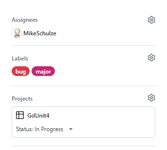
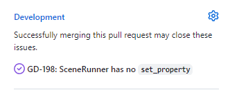

# Contributing to GdUnit4

**Thank you for considering contributing to GdUnit4!**
We appreciate your input and want to make the contribution process as easy and transparent as possible. Whether you want to report a bug, discuss code improvements, submit a fix, propose new features, or become a maintainer, we welcome your involvement.

## Reporting Bugs
If you encounter any bugs or issues, please use GitHub's issue tracking system. You can report a bug by [opening a new issue](https://github.com/MikeSchulze/gdUnit4/issues/new?assignees=MikeSchulze&labels=bug%2C+task&template=bug_report.md&title=). When submitting a bug report, please provide detailed information, including the steps to reproduce the issue, relevant background information, and sample code if possible.

## Development on GitHub
We use GitHub to host our code, track issues and feature requests, and accept pull requests.
We follow the <a href='https://docs.github.com/en/get-started/quickstart/github-flow' target="_blank">GitHub Flow</a> for making code changes. This means that all code modifications should be proposed through pull requests. Pull requests provide a structured and collaborative way to review and discuss code changes.

**If you'd like to contribute, please follow these steps:**

1. Select an open issue to work on or create a new issue if none exists.
   - Assign the issue to yourself and set its status to "In Progress." 
   
2. Fork the repository and create a branch from the `master` branch.
   - Use the issue number as the branch name, e.g., GD-111.
3. If you have made changes to the code that should be tested, please include appropriate tests.
4. If you have modified any APIs, ensure that the documentation is updated accordingly.
5. Create a pull request and provide information in the "Why" and "What" sections:
   - Link the pull request to the corresponding issue. 
   
   - Assign the pull request to yourself.
   - Make sure each pull request is associated with only one issue.
   - If the pull request is still in progress, mark it as a draft.
   - Ensure your code follows the [Coding Style](#coding-style) conventions
   - Ensure that the continuous integration (CI) process passes successfully.
6. Submit the pull request!

## License
By contributing to this project, you agree that your contributions will be licensed under the same <a href='https://github.com/MikeSchulze/gdUnit4/blob/master/LICENSE' target="_blank">MIT License</a> that covers the project. If you have any concerns, please reach out to the maintainers.

## Coding Style
To maintain code consistency, please adhere to the following coding style guides:
- <a href='https://docs.godotengine.org/en/stable/tutorials/scripting/gdscript/gdscript_styleguide.html' target="_blank">Godot's GDScript Conventions</a>
- <a href='https://docs.microsoft.com/en-us/dotnet/csharp/fundamentals/coding-style/coding-conventions' target="_blank">C# Coding Conventions</h>

