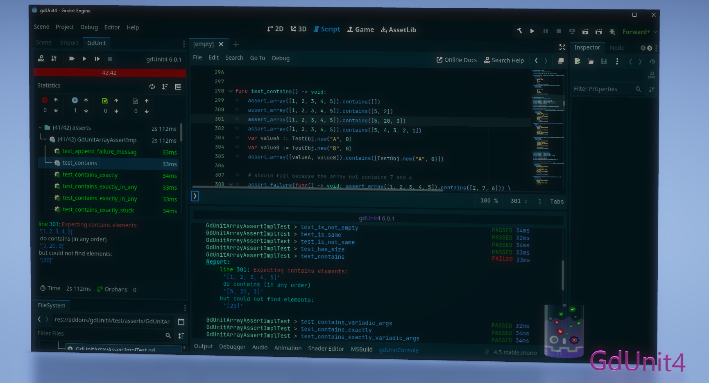

# GdUnit4 {{site.current_version}}


build on (v4.5.stable.mono.official [876b29033])

## What is GdUnit4?

**Gd**(*Godot*)**Unit**(*Unit Testing*)**4**(*Godot 4.x*)

GdUnit4 is an embedded unit testing framework designed for testing Gd scripts, C# scripts, and scenes in the Godot editor. With GdUnit4, you can easily
create and run unit tests to verify the functionality and performance of your code, ensuring that it meets your requirements and specifications. 
GdUnit4 is a powerful tool that supports Test-Driven Development ([TDD](https://en.wikipedia.org/wiki/Test-driven_development){:target="_blank"}),
a popular software development approach that emphasizes creating automated tests before writing any code. By using GdUnit4 for TDD,
you can ensure that your code is thoroughly tested and free of bugs, which can save you time and effort in the long run.

## Features

### Core Testing Features

* **Support for GDScript and C#**  
  Write and execute tests in both GDScript and C#
* **Embedded Test Inspector**  
  Navigate your test suites directly within the Godot editor
* **Test Discovery**  
  Automatically searches for tests at runtime and adds them to the inspector
* **Convenient Interface**  
  Run test-suites directly from Godot using the context menu (FileSystem panel, ScriptEditor, or GdUnit Inspector)
* **Create Tests from Editor**  
  Right-click on any function in the ScriptEditor and select "Create TestCase" to generate tests automatically

### Test Writing & Assertions

* **Fluent Syntax**  
  Write test cases with an easy-to-read, fluent interface
* **Wide Range of Assertions**  
  Comprehensive assertion methods for verifying behavior and output
* **Argument Matchers**  
  Verify function calls with expected arguments
* **Unicode Text Support**  
  Full support for unicode characters in test strings and assertions
* **Variadic Arguments Support**  
  Test functions that accept variable numbers of arguments

### Advanced Testing Capabilities

* **Test Fuzzing**  
  Generate random inputs to test edge cases and boundary conditions
* **Parameterized Tests**  
  Test functions with multiple sets of inputs and expected outputs
* **Test Session Hooks**  
  Set up and tear down test resources at the session level for efficient test management
* **Mocking & Spying**
    * Mock classes to simulate behavior and define output for specific functions
    * Spy on functions to verify they were called with expected parameters
    * Mock or spy on scenes to simulate behavior and verify function calls
* **Scene Runner**  
  Simulate different kinds of inputs and actions:
    * Mouse clicks and movements
    * Keyboard inputs
    * Touch screen interactions
    * Custom input actions
    * Wait for specific signals or function return values
* **Flaky Test Handling**  
  Detect and handle flaky tests by rerunning failed tests  
  Configure retry count and mark non-deterministic failures in test results
* **Configurable Templates**  
  Customize templates for generating new test-suites

### Continuous Integration Support

* **Command Line Tool**  
  Run tests outside the Godot editor for CI/CD pipelines
* **HTML Report Generation**  
  Generate comprehensive HTML test reports
* **JUnit XML Report**  
  Export test results in JUnit XML format for CI integration
* **GitHub Action Integration**  
  Public marketplace action for integrating GdUnit4 into your CI workflow  
  [gdunit4-action](https://github.com/marketplace/actions/gdunit4-test-runner-action)

### GdUnit4Net - C# Support

* **C# API** - [gdUnit4.api](https://github.com/MikeSchulze/gdUnit4Net/blob/master/README.md)  
  Full support for writing tests in C#
* **VSTest Integration** - [gdunit4.test.adapter](https://github.com/MikeSchulze/gdUnit4Net/blob/master/TestAdapter/README.md)  
  Run and debug tests in:
    * Visual Studio
    * Visual Studio Code
    * JetBrains Rider

## You are welcome to
<!-- markdownlint-capture -->
<!-- markdownlint-disable -->
* [Give Feedback](https://github.com/MikeSchulze/gdUnit4/discussions/157){:target="_blank"} on the gdUnit GitHub Discussions page.
* [Suggest Improvements](https://github.com/MikeSchulze/gdUnit4/issues/new?assignees=MikeSchulze&labels=enhancement&template=feature_request.md&title=){:target="_blank"} by creating a new feature request issue on the gdUnit GitHub Issues page.
* [Report Bugs](https://github.com/MikeSchulze/gdUnit4/issues/new?assignees=MikeSchulze&labels=bug&projects=projects%2F5&template=bug_report.yml&title=GD-XXX%3A+Describe+the+issue+briefly){:target="_blank"} by creating a new bug report issue on the gdUnit GitHub Issues page.
<!-- markdownlint-enable -->
<!-- markdownlint-restore -->
