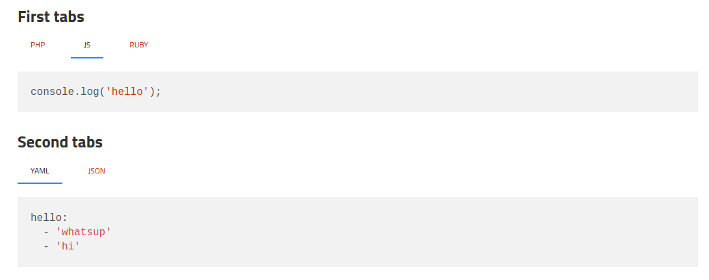

Jekyll Tabs
===========

This Jekyll plugin provides tags used to add tabs in your content. It is heavily inspired from https://github.com/clustergarage/jekyll-code-tabs.
  * It works with multiple tab panels on the same page
  * It does not require a specific javascript framework

Installation
------------

### Install the plugin

Add this line to your `Gemfile`:

```ruby
group :jekyll_plugins do
  # ... other gems
  gem "jekyll-tabs"
end
```

Install the gem by running:

```bash
bundle install
```

Then add the gem to the plugin list in your `_config.yml` file:

```yaml
plugins:
  - jekyll-tabs
```

### Include the javascript

Copy the content of [this file](https://raw.githubusercontent.com/Ovski4/jekyll-tabs/master/docs/tabs.js) in your public folder (for example **assets/js/tabs.js**), and include the script in your layout (such as **_layouts/default.html**).

```html
<!DOCTYPE html>
<html lang="en-us">
    <head>
        ...
    </head>
    <body>
        {{ content }}
        <script src="/assets/js/tabs.js"></script>
    </body>
</html>
```

### Style the tabs

Feel free to style it the way you want. You can use [this existing css file](https://raw.githubusercontent.com/Ovski4/jekyll-tabs/master/docs/tabs.css) to get started.

Paste the content in a file (for example **assets/css/custom.css**), and include it in the html <head> tag of your jekyll website.

```html
<!DOCTYPE html>
<html lang="en-us">
    <head>
        ...
        <link rel="stylesheet" href="/assets/css/custom.css">
    </head>
    <body>
        ....
```

You are all set! Let's see the markup.

Usage
-----

### Create the markup

````
### First tabs




```php
var_dump('hello');
```



```javascript
console.log('hello');
```



```javascript
pputs 'hello'
```




### Second tabs




```yaml
hello:
  - 'whatsup'
  - 'hi'
```



```json
{
    "hello": ["whatsup", "hi"]
}
```




````

Here is the result:



In the following markup:

```

```

* The first word after the `tab` keyword (`data-struct` here) is used to group tabs.
* All words after will be displayed as the tab label.

Which is why in the above example, we have 2 groups of tabs: `data-struct` and `log`.

Additional configuration
------------------------

### Sync tabs with similar labels

To get all tabs with the same label synced, set the `syncTabsWithSameLabels` value to **true** in the `jekyllTabsConfiguration` object ([link to related line of code](https://github.com/Ovski4/jekyll-tabs/blob/master/docs/tabs.js#L5)).

### Open a specific tab on page load

To link and open a specific tab on page load, set the `activateTabFromUrl` value to **true** in the `jekyllTabsConfiguration` object ([link to related line of code](https://github.com/Ovski4/jekyll-tabs/blob/master/docs/tabs.js#L6)).

You will need to append a combination of url anchor (#) and query param (?active_tab) to the page URL.

* The anchor is used to target the tab group
* The query parameter `active_tab` is used to target the tab that will open

Clicking on a tab will automatically set the anchor and query parameter in the url.

### Add a copy to clipboard button

To get a button to copy the code within a tab, set the `addCopyToClipboardButton` value to **true** in the `jekyllTabsConfiguration` object ([link to related line of code](https://github.com/Ovski4/jekyll-tabs/blob/master/docs/tabs.js#L7)).

This will apply only if `<pre>` tags can be found inside the tabs contents.

You can override the button HTML using the `copyToClipboardButtonHtml` property.
